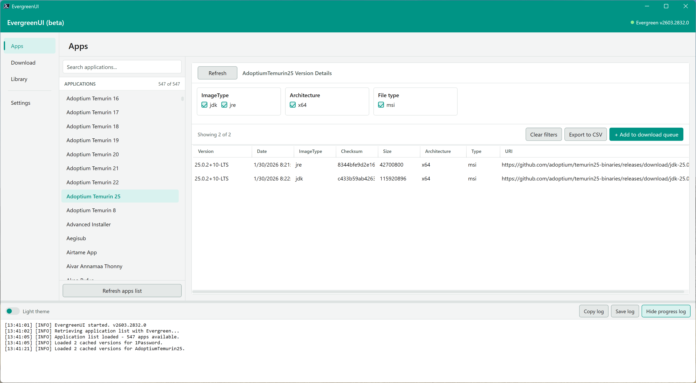

# Evergreen Workbench

A WPF-based graphical frontend for the [Evergreen](https://eucpilots.com/evergreen-docs/) PowerShell module.

Evergreen Workbench ships as a separate PowerShell module so it never modifies the core Evergreen module. It targets Windows only, requires no external DLLs, and supports both **PowerShell 5.1** (Desktop) and **PowerShell 7+**.



> **Status:** Pre-release - core functionality implemented; published to PSGallery as beta.

## Features

- **Apps view** - search and browse all 500+ Evergreen-supported applications; inspect version and download metadata returned by `Get-EvergreenApp`
- **Dynamic filters** - filter panel builds itself at runtime from whatever properties a given app actually returns (Architecture, Channel, Ring, Language, Type, Release, etc.)
- **Download queue** - select multiple app/version combinations and download them sequentially via `Save-EvergreenApp`
- **Library management** - inspect and update an Evergreen library on disk using `Start-EvergreenLibraryUpdate` and related cmdlets
- **Import tab (placeholder)** - switch between provider workflows (Nerdio Manager and Microsoft Intune) using left-side workflow navigation, ready for provider-specific implementation phases
- **Fluent UI design** - light and dark themes aligned to the Evergreen docs brand palette
- **Real-time log panel** - timestamped progress log with `Info`, `Warning`, and `Error` levels, updated live from background runspaces
- **Session persistence** - last-used paths, theme, window size, and startup view stored in `$env:APPDATA\EvergreenUI\settings.json`

## Requirements

| Requirement | Minimum |
|---|---|
| Operating system | Windows 10 / Windows Server 2019 or later |
| PowerShell | 5.1 (Desktop) or 7.0+ |
| .NET | .NET Framework 4.7.2+ (for PS 5.1) or .NET 6+ (for PS 7+) |
| Evergreen module | 2603.2832.0 or later (installed from PSGallery) |

No additional DLLs are required. The UI is built entirely using WPF assemblies that ship with Windows.

## Installation

To install from the PowerShell Gallery:

```powershell
Install-Module -Name EvergreenUI -AllowPrerelease
```

To run from source:

```powershell
# Install the Evergreen dependency first
Install-Module -Name Evergreen -Scope CurrentUser

# Clone the repository and import the module directly
git clone https://github.com/EUCPilots/evergreen-ui.git
Import-Module ./evergreen-ui/EvergreenUI/EvergreenUI.psd1
```

## Usage

```powershell
Import-Module EvergreenUI
Start-EvergreenWorkbench
```

## Repository structure

```
EvergreenUI/
├── .gitignore
├── README.md
├── CHANGELOG.md
│
├── docs/                          # Design documents and specifications
│   ├── plan.md                    # Architecture and module design plan
│   └── filter-design.md           # Dynamic filter panel specification
│
├── EvergreenUI/                   # The PowerShell module
│   ├── EvergreenUI.psd1           # Module manifest
│   ├── EvergreenUI.psm1           # Root module (dot-sources Public + Private)
│   │
│   ├── Public/
│   │   └── Start-EvergreenWorkbench.ps1  # Only exported function - launches the GUI
│   │
│   └── Private/
│       ├── themes/
│       │   ├── Set-LightTheme.ps1
│       │   └── Set-DarkTheme.ps1
│       ├── Get-EvergreenAppList.ps1
│       ├── New-WpfRunspace.ps1
│       ├── Write-UILog.ps1
│       ├── Test-EvergreenModule.ps1
│       ├── Get-FilterableProperties.ps1
│       ├── New-FilterPanel.ps1
│       ├── Invoke-FilterUpdate.ps1
│       ├── Invoke-AppDownload.ps1
│       ├── Invoke-LibraryUpdate.ps1
│       ├── Get-UIConfig.ps1
│       └── Set-UIConfig.ps1
│
└── tests/                         # Pester tests
    └── EvergreenUI.tests.ps1
```

## Design documentation

Full design decisions are recorded in the `/docs` folder:

- [`docs/plan.md`](docs/plan.md) - module architecture, view layouts, threading model, build phases
- [`docs/filter-design.md`](docs/filter-design.md) - dynamic filter panel design, property taxonomy, edge case handling

A static interactive HTML prototype is available at [`prototype/EvergreenUI-Prototype.html`](prototype/EvergreenUI-Prototype.html) - open it in any browser to explore the intended UI with dummy data. No server or build step required.

## Contributing

This module follows the same conventions as the [Evergreen](https://github.com/EUCPilots/evergreen-module) and [evergreen-apps](https://github.com/EUCPilots/evergreen-apps) repositories:

- Strict mode (`Set-StrictMode -Version Latest`) in all scripts
- `$ErrorActionPreference = 'Stop'` at script scope
- PowerShell 5.1 and 7+ compatible syntax (no `??=`, no ternary in 5.1 code paths)
- PSScriptAnalyzer clean (default ruleset)
- Pester tests for all Public functions

## Licence

[MIT](LICENSE)
